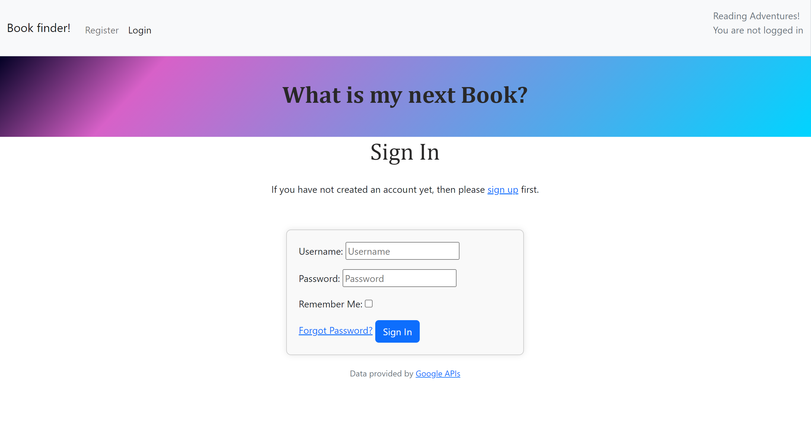
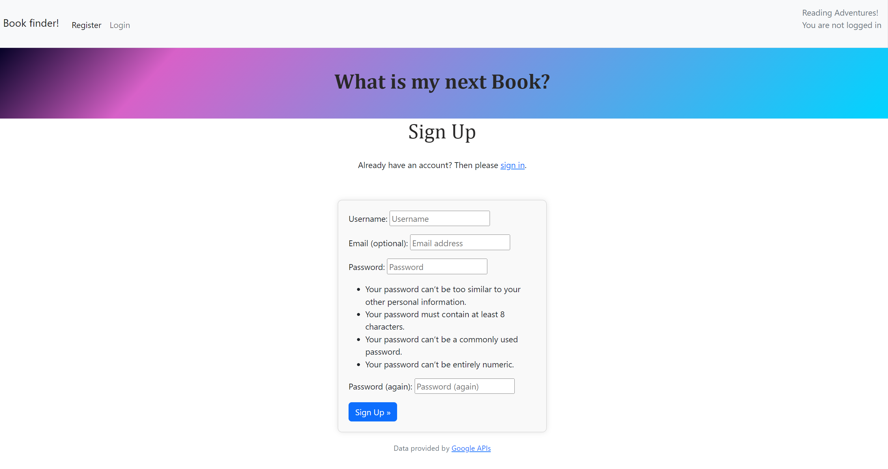
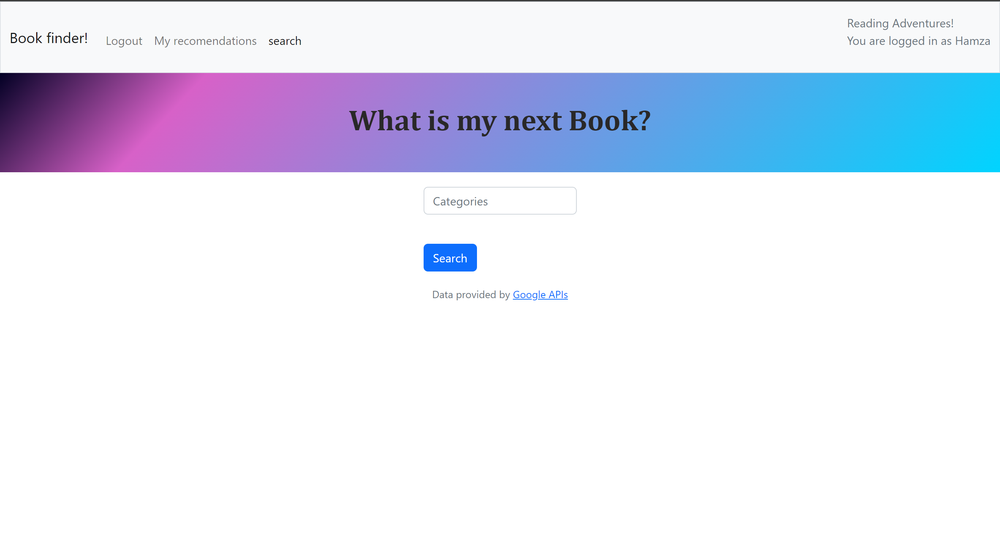
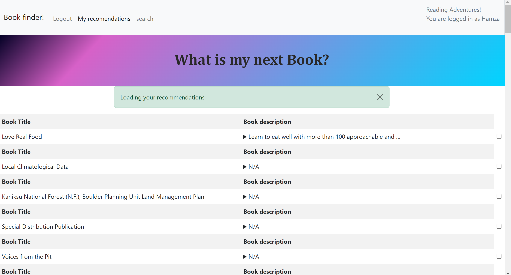
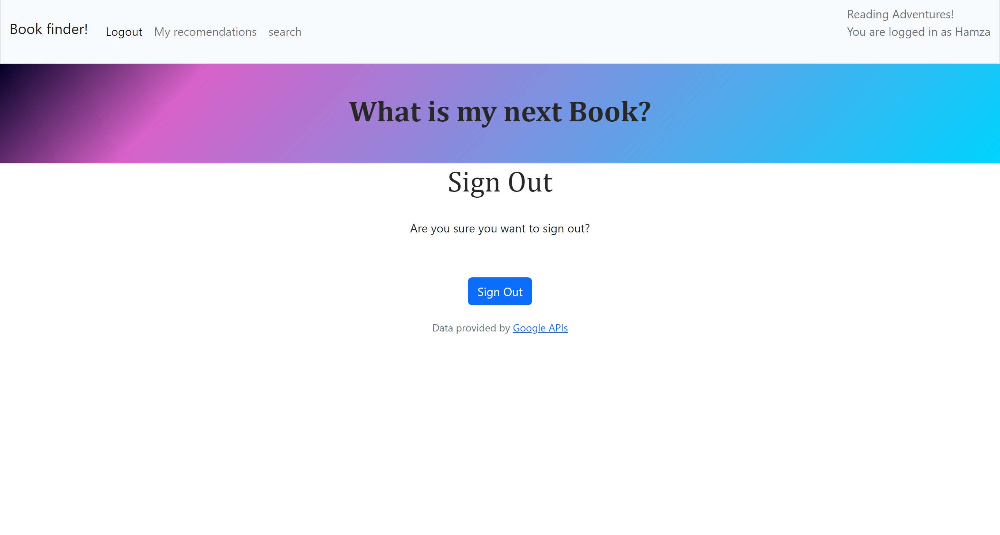

# project_3_django

This project is a Book Recommendation System built with Django. It allows users to search for book recommendations based on genres, save these recommendations to their portfolio, and view their saved recommendations.

## Features

- User authentication with login required to access certain views.
- Search for books by genre using the Google Books API.
- Save recommended books to a user's portfolio.
- View saved book recommendations.

## Installation

### Prerequisites

- Python 3.x
- Django 3.x or higher
- Requests library

### Setup

1. Clone the repository:
2. Create a virtual environment and activate it:
3. Install the required packages:
4. Set up environment variables:
5. Make sure to add env.py to your .gitignore file to avoid committing your API key:
6. Apply migrations and start the development server:

### Project Structure

project_3_django/
│
├── home_page/
│   ├── templates/
│   │   ├── home_page/
│   │   │   ├── apology.html
│   │   │   ├── portfolio.html
│   │   │   ├── results.html
│   │   │   └── search.html
│   │   └── base.html
│   ├── views.py
│   ├── models.py
│   └── urls.py
│
├── services.py
├── manage.py
├── requirements.txt
├── Procfile
└── env.py

## Preview

## Credits

This project is created by Ahmed Hamad thanks to the developers of Django and Requests for their amazing libraries.. Feel free to contribute or report issues if any.
